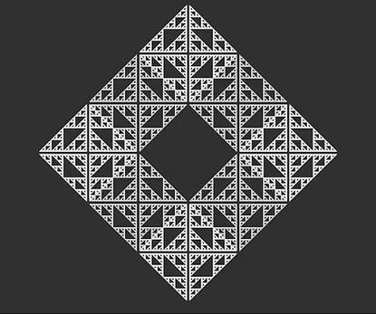
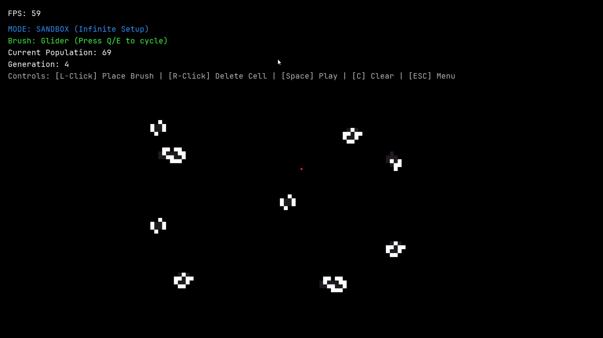
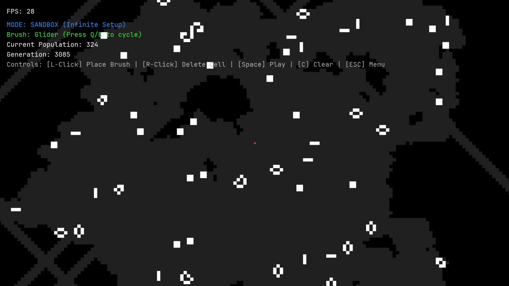

<!--
Hey, thanks for using the awesome-readme-template template.  
If you have any enhancements, then fork this project and create a pull request 
or just open an issue with the label "enhancement".

Don't forget to give this project a star for additional support ;)
Maybe you can mention me or this repo in the acknowledgements too
-->
<div align="center">

  <a href="https://github.com/sanskar-sol/conways-game">
    
  </a>
  
<!-- Badges -->
<p>
  <a href="https://github.com/sanskar-sol/conways-game/graphs/contributors">
    
  </a>
  <a href="https://github.com/sanskar-sol/conways-game/commits/main">
    
  </a>
  <a href="https://github.com/sanskar-sol/conways-game/network/members">
    
  </a>
  <a href="https://github.com/sanskar-sol/conways-game/stargazers">
    
  </a>
  <a href="https://github.com/sanskar-sol/conways-game/issues/">
    
  </a>
  <a href="https://github.com/sanskar-sol/conways-game/blob/main/LICENSE">
    
  </a>
</p>
   
<h4>
    <a href="https://github.com/sanskar-sol/conways-game#usage">View Controls & Usage</a>
  <span> · </span>
    <a href="https://github.com/sanskar-sol/conways-game#getting-started">Getting Started</a>
  <span> · </span>
    <a href="https://github.com/sanskar-sol/conways-game/issues/">Report Bug</a>
  <span> · </span>
    <a href="https://github.com/sanskar-sol/conways-game/issues/">Request Feature</a>
  </h4>
</div>

<br />

<!-- Table of Contents -->
# Table of Contents

- [About the Project](#about-the-project)
  * [Screenshots](#screenshots)
  * [Tech Stack](#tech-stack)
  * [Features](#features)
  * [Color Reference](#color-reference)
  * [Environment Variables](#environment-variables)
- [Getting Started](#getting-started)
  * [Prerequisites](#prerequisites)
  * [Installation](#installation)
  * [Running Tests](#running-tests)
  * [Run Locally](#run-locally)
  * [Deployment](#deployment)
- [Usage](#usage)
  * [Game Modes](#game-modes)
  * [Keybindings & Controls](#keybindings--controls)
  * [Pattern Presets](#pattern-presets)
- [Roadmap](#roadmap)
- [Contributing](#contributing)
  * [Code of Conduct](#code-of-conduct)
- [FAQ](#faq)
- [License](#license)
- [Contact](#contact)
- [Acknowledgements](#acknowledgements)
  

<!-- About the Project -->
## About the Project

**Conway: The Aeon Simulator** is an interactive, performance-optimized cellular automata simulation engine built with Python, Pygame, and OpenCV.

Beyond standard simulation, it introduces game mechanics like **The 10-Cell Challenge** (a puzzle mode where you strive to reach 100+ population with $\le 10$ seed cells), a full-featured **Infinite Sandbox Mode** with brush selectors and camera panning, and persistent footprint tracking to visualize the historical trajectory of living cells.


<!-- Screenshots -->
### Screenshots

<div align="center"> 
  
  
</div>


<!-- TechStack -->
### Tech Stack

<details>
  <summary>Engine & Graphics</summary>
  <ul>
    <li><a href="https://www.python.org/">Python 3.8+</a></li>
    <li><a href="https://www.pygame.org/">Pygame</a> - Game loop, windowing, UI rendering, audio/event management</li>
    <li><a href="https://opencv.org/">OpenCV (cv2)</a> - High-performance background video playback in menus</li>
  </ul>
</details>

<details>
  <summary>Typography & Assets</summary>
  <ul>
    <li><a href="https://www.nerdfonts.com/">JetBrains Mono Nerd Font</a> - Monospace developer HUD styling</li>
  </ul>
</details>

<!-- Features -->
### Features

- **Dynamic Video Menu**: Interactive animated menu rendered smoothly with OpenCV and Pygame.
- **The 10-Cell Challenge Mode**: Puzzle gameplay where players attempt to reach a population threshold of 100+ starting with only 10 initial cells. Includes an incremental hint system.
- **Infinite Sandbox Mode**: Freely draw, erase, and experiment with customizable preset brushes across an infinite grid space.
- **Preset Stamp Library**: Built-in classic configurations including *Single Cell*, *Glider*, *Toad*, *Methuselah*, and *Acorn*.
- **Sparse Matrix Neighbor Checking**: Fast, sparse dictionary-based evaluation algorithm capable of scaling to large coordinate spaces without bounding box constraints.
- **Touched Territory Tracker**: Visual trail that leaves a trace on every grid coordinate that was ever touched by living cells.
- **Smooth Camera & HUD**: Free camera navigation (`WASD` / Arrow keys) with live metrics (FPS, Generation, Live Score/Population, and Coordinates).

<!-- Color Reference -->
### Color Reference

| Color | Hex | Role |
| :--- | :--- | :--- |
| Background |  `#000000` | Grid canvas background |
| Alive Cell |  `#FFFFFF` | Living cell / Active state |
| Touched Trail |  `#202020` | Historical touched cell trail |
| Accent Red / Pause |  `#FF3232` | Paused indicator & Crosshair reticle |
| Victory Green |  `#32FF32` | Victory state & Goal progress |
| Sandbox Accent Blue |  `#3296FF` | Sandbox mode branding & HUD |
| Hint Yellow |  `#FFFF00` | Guided placement hints |


<!-- Env Variables -->
### Environment Variables

No external API keys or environment variables are required to run this project.


<!-- Getting Started -->
## Getting Started

<!-- Prerequisites -->
### Prerequisites

Ensure you have Python 3.8 or higher installed on your system.

```bash
python --version
```

<!-- Installation -->
### Installation

1. Clone the repository:
```bash
git clone https://github.com/sanskar-sol/conways-game.git
cd conways-game
```

2. Install the required Python packages:
```bash
pip install pygame opencv-python
```

<!-- Running Tests -->
### Running Tests

To verify the cellular automata update logic independently, execute the standalone logic test:

```bash
python logic.py
```

<!-- Run Locally -->
### Run Locally

Launch the full interactive game (with Video Menu, Challenge Mode, and Sandbox):

```bash
python sandbox.py
```

Or run the classic windowed simulation:

```bash
python main.py
```


<!-- Deployment -->
### Deployment

To package the game as a standalone desktop executable (.exe / binary):

```bash
pip install pyinstaller
pyinstaller --noconfirm --onedir --windowed --add-data "assets;assets" sandbox.py
```


<!-- Usage -->
## Usage

### Game Modes

1. **Challenge Mode (`The 10-Cell Challenge`)**:
   - Place up to 10 starting cells on the board during generation 0.
   - Press `Space` to begin the simulation.
   - If your colony survives and expands past a population of **100**, you win!
   - Stuck? Press `H` to unlock guided hints step-by-step.

2. **Sandbox Mode (`Infinite Setup`)**:
   - Freely test any cellular pattern or design mega-structures.
   - Switch brush presets with `Q` and `E`.
   - Left-click to place the selected stamp; Right-click to delete individual cells.

### Keybindings & Controls

| Action | Key / Input |
| :--- | :--- |
| **Pan Camera** | `W` / `A` / `S` / `D` or `Arrow Keys` |
| **Play / Pause** | `Spacebar` |
| **Place Cell / Pattern Brush** | `Left Click` |
| **Erase Cell** | `Right Click` |
| **Cycle Pattern Brush** | `Q` (Previous) / `E` (Next) |
| **Show Next Hint (Challenge Mode)** | `H` |
| **Reset Board** | `R` |
| **Clear Board (Sandbox Mode)** | `C` |
| **Return to Menu** | `Esc` |

### Pattern Presets

```python
# Available built-in patterns
PRESETS = {
    "Single Cell": {(0, 0)},
    "Glider": {(0, 0), (1, 0), (2, 0), (2, -1), (1, -2)},
    "Toad": {(0, 0), (1, 0), (2, 0), (-1, 1), (0, 1), (1, 1)},
    "Methuselah": {(0, -1), (1, -1), (-1, 0), (0, 0), (0, 1)},
    "Acorn": {(1, -1), (3, 0), (0, 1), (1, 1), (4, 1), (5, 1), (6, 1)}
}
```


<!-- Roadmap -->
## Roadmap

* [x] Core sparse matrix Conway's Game of Life algorithm
* [x] Dynamic background video main menu with OpenCV integration
* [x] Interactive 10-Cell challenge mode with hint mechanics
* [x] Infinite Sandbox mode with pattern brushes
* [x] Cell footprint / touched trail tracking
* [ ] Zoom in / Zoom out camera scaling support
* [ ] Save and export custom pattern RLE / Life 1.05 files
* [ ] Sound effects and ambient generative audio


<!-- Contributing -->
## Contributing

Contributions are always welcome!

1. Fork the Project
2. Create your Feature Branch (`git checkout -b feature/AmazingFeature`)
3. Commit your Changes (`git commit -m 'Add some AmazingFeature'`)
4. Push to the Branch (`git push origin feature/AmazingFeature`)
5. Open a Pull Request


<!-- Code of Conduct -->
### Code of Conduct

Please follow standard community guidelines and open-source etiquette when contributing to this repository.


<!-- FAQ -->
## FAQ

- **Why does the simulation run so smoothly on large populations?**
  + Instead of updating an entire $N \times N$ 2D grid array on every tick, the engine utilizes a sparse dictionary map to calculate neighbor counts only for live cells and their immediate adjacent perimeters.

- **How do I exit fullscreen mode?**
  + Press `Esc` to return to the main menu, or select `Quit`.


<!-- License -->
## License

Distributed under the MIT License. See `LICENSE` for more information.


<!-- Contact -->
## Contact

Sanskar - [GitHub Profile](https://github.com/sanskar-sol)

Project Link: [https://github.com/sanskar-sol/conways-game](https://github.com/sanskar-sol/conways-game)


<!-- Acknowledgments -->
## Acknowledgements

- [Shields.io](https://shields.io/)
- [Awesome README Template](https://github.com/Louis3797/awesome-readme-template)
- [Pygame Community](https://www.pygame.org/)
- [ConwayLife.com Patterns Wiki](https://conwaylife.com/wiki/)
